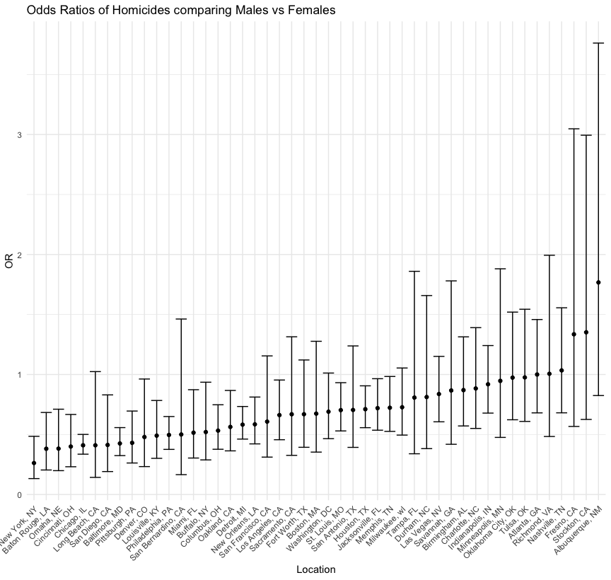
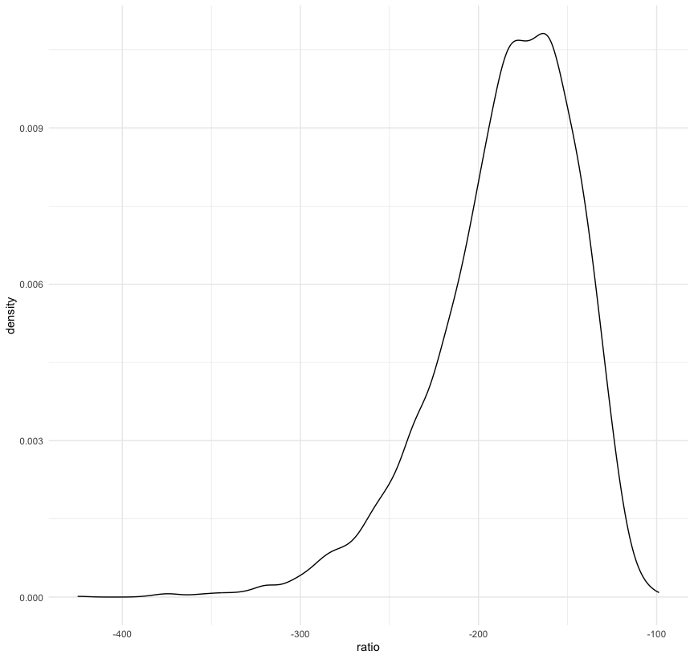
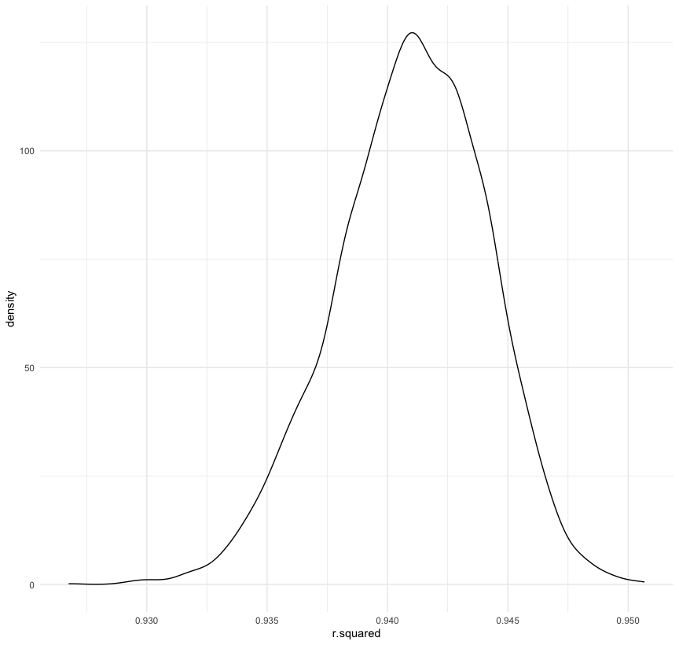
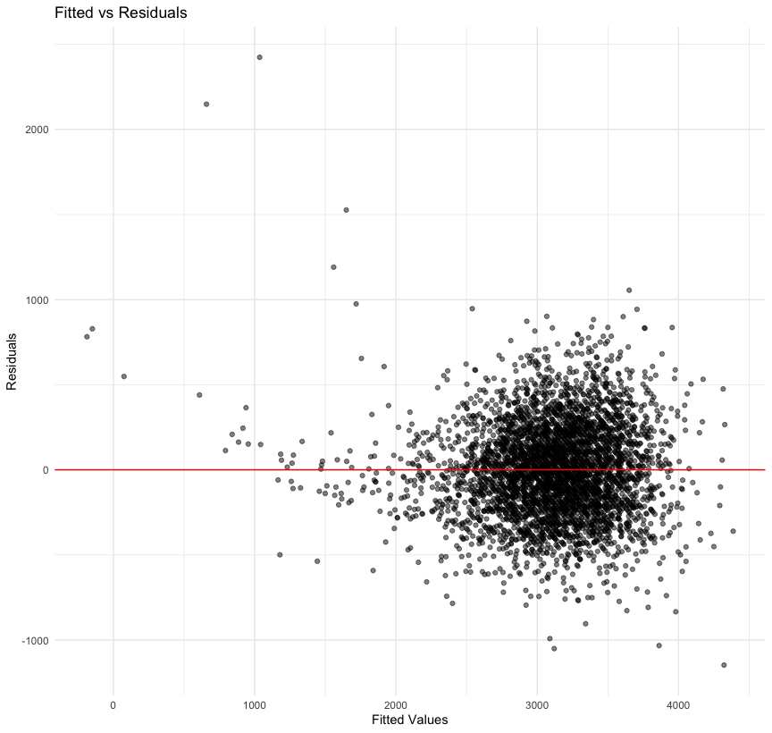
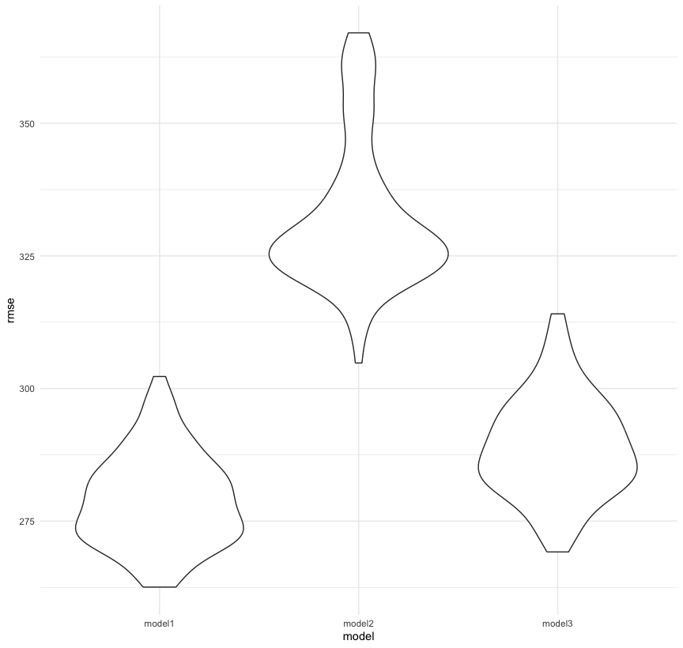

Homework 6
================
Kallan Roan
2025-11-23

Load libraries

``` r
library(tidyverse)
```

    ## ── Attaching core tidyverse packages ──────────────────────── tidyverse 2.0.0 ──
    ## ✔ dplyr     1.1.4     ✔ readr     2.1.5
    ## ✔ forcats   1.0.0     ✔ stringr   1.5.1
    ## ✔ ggplot2   3.5.2     ✔ tibble    3.3.0
    ## ✔ lubridate 1.9.4     ✔ tidyr     1.3.1
    ## ✔ purrr     1.1.0     
    ## ── Conflicts ────────────────────────────────────────── tidyverse_conflicts() ──
    ## ✖ dplyr::filter() masks stats::filter()
    ## ✖ dplyr::lag()    masks stats::lag()
    ## ℹ Use the conflicted package (<http://conflicted.r-lib.org/>) to force all conflicts to become errors

``` r
library(p8105.datasets)
library(modelr)
```

Set seed

``` r
set.seed(1)
```

Preset settings

``` r
knitr::opts_chunk$set(
  fig.width = 9,
  fig.asp = .95,
  out.width = "90%"
)

theme_set(theme_minimal() + theme(legend.position = "bottom"))

options(
  ggplot2.continuous.colour = "viridis",
  ggplot2.continuous.fill = "viridis"
)

scale_colour_discrete = scale_colour_viridis_d
scale_fill_discrete = scale_fill_viridis_d
```

## Problem 1

Import data and clean data to include criteria indicated below: Create a
city_state variable (e.g. “Baltimore, MD”), and a binary variable
indicating whether the homicide is solved. Omit cities Dallas, TX;
Phoenix, AZ; and Kansas City, MO – these don’t report victim race. Also
omit Tulsa, AL – this is a data entry mistake. For this problem, limit
your analysis those for whom victim_race is white or black. Be sure that
victim_age is numeric.

``` r
homicide_df = 
  read_csv("data/homicide-data.csv") |>
  janitor::clean_names() |> 
  mutate(
    city_state = str_c(city, ", ", state),
    resolved = as.numeric(disposition == "Closed by arrest"),
    victim_age = as.numeric(victim_age)
  ) |> 
  filter(
    !city_state %in% c("Dallas, TX", "Phoenix, AZ", "Kansas City, MO", "Tulsa, AL"),
    victim_race %in% c("White", "Black")
    ) |> 
  select(resolved, victim_age, victim_race, victim_sex, city_state)
```

    ## Rows: 52179 Columns: 12
    ## ── Column specification ────────────────────────────────────────────────────────
    ## Delimiter: ","
    ## chr (9): uid, victim_last, victim_first, victim_race, victim_age, victim_sex...
    ## dbl (3): reported_date, lat, lon
    ## 
    ## ℹ Use `spec()` to retrieve the full column specification for this data.
    ## ℹ Specify the column types or set `show_col_types = FALSE` to quiet this message.

    ## Warning: There was 1 warning in `mutate()`.
    ## ℹ In argument: `victim_age = as.numeric(victim_age)`.
    ## Caused by warning:
    ## ! NAs introduced by coercion

Logistic regression with resolved vs unresolved as the outcome and
victim age, sex and race as predictors for Baltimore, MD.

``` r
balt_fit_logistic = 
  homicide_df |> 
  filter(city_state == "Baltimore, MD") |> 
  glm(resolved ~ victim_age + victim_sex + victim_race, data = _, family = binomial())

balt_fit_logistic |> 
  broom::tidy(conf.int = TRUE) |> 
  mutate(
    OR = exp(estimate),
    conf_lower = exp(conf.low),
    conf_upper = exp(conf.high)
  ) |> 
  filter(term == "victim_sexMale") |> 
  select(OR, conf_lower, conf_upper) |> 
  knitr::kable(digits = 3)
```

|    OR | conf_lower | conf_upper |
|------:|-----------:|-----------:|
| 0.426 |      0.324 |      0.558 |

Logistic regression with resolved vs unresolved as the outcome and
victim age, sex and race as predictors for all cities.

Create function to run logistic regression

``` r
homicide_glm = function(df) {
  
  glm(resolved ~ victim_age + victim_sex + victim_race, data = df, family = binomial())

}
```

Run logistic regression for all cities

``` r
fit_logistic_all = 
  homicide_df |> 
  nest(data = -city_state) |> 
  mutate(
    fits = map(data, homicide_glm),
    results = map(fits, \(df) broom::tidy(df, conf.int = TRUE))
  ) |> 
  select(city_state, results) |> 
  unnest(results) |> 
  mutate(
    OR = exp(estimate),
    conf_lower = exp(conf.low),
    conf_upper = exp(conf.high)
  ) |> 
  filter(term == "victim_sexMale") |> 
  select(city_state, OR, conf_lower, conf_upper)
```

    ## Warning: There were 43 warnings in `mutate()`.
    ## The first warning was:
    ## ℹ In argument: `results = map(fits, function(df) broom::tidy(df, conf.int =
    ##   TRUE))`.
    ## Caused by warning:
    ## ! glm.fit: fitted probabilities numerically 0 or 1 occurred
    ## ℹ Run `dplyr::last_dplyr_warnings()` to see the 42 remaining warnings.

``` r
fit_logistic_all |> 
  knitr::kable(digits = 3)
```

| city_state         |    OR | conf_lower | conf_upper |
|:-------------------|------:|-----------:|-----------:|
| Albuquerque, NM    | 1.767 |      0.825 |      3.762 |
| Atlanta, GA        | 1.000 |      0.680 |      1.458 |
| Baltimore, MD      | 0.426 |      0.324 |      0.558 |
| Baton Rouge, LA    | 0.381 |      0.204 |      0.684 |
| Birmingham, AL     | 0.870 |      0.571 |      1.314 |
| Boston, MA         | 0.674 |      0.353 |      1.277 |
| Buffalo, NY        | 0.521 |      0.288 |      0.936 |
| Charlotte, NC      | 0.884 |      0.551 |      1.391 |
| Chicago, IL        | 0.410 |      0.336 |      0.501 |
| Cincinnati, OH     | 0.400 |      0.231 |      0.667 |
| Columbus, OH       | 0.532 |      0.377 |      0.748 |
| Denver, CO         | 0.479 |      0.233 |      0.962 |
| Detroit, MI        | 0.582 |      0.462 |      0.734 |
| Durham, NC         | 0.812 |      0.382 |      1.658 |
| Fort Worth, TX     | 0.669 |      0.394 |      1.121 |
| Fresno, CA         | 1.335 |      0.567 |      3.048 |
| Houston, TX        | 0.711 |      0.557 |      0.906 |
| Indianapolis, IN   | 0.919 |      0.678 |      1.241 |
| Jacksonville, FL   | 0.720 |      0.536 |      0.965 |
| Las Vegas, NV      | 0.837 |      0.606 |      1.151 |
| Long Beach, CA     | 0.410 |      0.143 |      1.024 |
| Los Angeles, CA    | 0.662 |      0.457 |      0.954 |
| Louisville, KY     | 0.491 |      0.301 |      0.784 |
| Memphis, TN        | 0.723 |      0.526 |      0.984 |
| Miami, FL          | 0.515 |      0.304 |      0.873 |
| Milwaukee, wI      | 0.727 |      0.495 |      1.054 |
| Minneapolis, MN    | 0.947 |      0.476 |      1.881 |
| Nashville, TN      | 1.034 |      0.681 |      1.556 |
| New Orleans, LA    | 0.585 |      0.422 |      0.812 |
| New York, NY       | 0.262 |      0.133 |      0.485 |
| Oakland, CA        | 0.563 |      0.364 |      0.867 |
| Oklahoma City, OK  | 0.974 |      0.623 |      1.520 |
| Omaha, NE          | 0.382 |      0.199 |      0.711 |
| Philadelphia, PA   | 0.496 |      0.376 |      0.650 |
| Pittsburgh, PA     | 0.431 |      0.263 |      0.696 |
| Richmond, VA       | 1.006 |      0.483 |      1.994 |
| San Antonio, TX    | 0.705 |      0.393 |      1.238 |
| Sacramento, CA     | 0.669 |      0.326 |      1.314 |
| Savannah, GA       | 0.867 |      0.419 |      1.780 |
| San Bernardino, CA | 0.500 |      0.166 |      1.462 |
| San Diego, CA      | 0.413 |      0.191 |      0.830 |
| San Francisco, CA  | 0.608 |      0.312 |      1.155 |
| St. Louis, MO      | 0.703 |      0.530 |      0.932 |
| Stockton, CA       | 1.352 |      0.626 |      2.994 |
| Tampa, FL          | 0.808 |      0.340 |      1.860 |
| Tulsa, OK          | 0.976 |      0.609 |      1.544 |
| Washington, DC     | 0.690 |      0.465 |      1.012 |

Create plot that shows OR’s and Ci’s for each city

``` r
fit_logistic_all |> 
  mutate(
    city_state = fct_reorder(city_state, OR)
  ) |> 
  ggplot(aes(x = city_state, y = OR)) +
  geom_point() +
  geom_errorbar(aes(ymin = conf_lower, ymax = conf_upper)) +
  theme(axis.text.x = element_text(angle = 45, hjust = 1)) +
  labs(
    title = "Odds Ratios of Homicides comparing Males vs Females",
    x = "Location",
    y = "OR"
  ) 
```



The majority of cities (41 of 47 total cities) have odds ratios that are
less than 1, meaning that for most cities, the odds of homicides are
greater among females than males. For some cities, the odds ratios are
significant, since the confidence intervals do not include the null
value of 1. On the other hand, only 6 cities have odds ratios greater
than 1, meaning that the odds of homicides is greater among males vs
females. However, the odds are not significant, since the confidence
intervals for all of those odds ratios include the null value of 1.
Therefore, most U.S cities follow the trend that females have a higher
odds of being vicims of homicide compared to males.

Albuquerque, NM has the highest, but insignificant odds ratio of 1.767
with the widest 95% confidence interval of (0.825, 3.762). On the other
hand, New York, NY has the lowest homicide odds ratio comparing males to
females of 0.262 (95% CI: 0.133, 0.485). Chicago, IL has the narrowest
95% confidence interval of (0.336, 0.501) and OR = 0.410

## Problem 2

Load weather dataset

``` r
data("weather_df")
```

5000 Bootstrap samples. Produce tibbles from tidy and glance.

``` r
weather_bootstrap_results = 
  weather_df |> 
  bootstrap(n = 5000) |> 
  mutate(
    df = map(strap, as_tibble),
    fits = map(df, \(df) lm(tmax ~ tmin + prcp, data = df)),
    results_1 = map(fits, broom::tidy),
    results_2 = map(fits, broom::glance)
  ) |> 
  select(.id, results_1, results_2)
```

Extract r.squared and ratio

``` r
weather_bootstrap_results_cleaned = 
  weather_bootstrap_results |> 
  unnest(results_2) |> 
  select(.id, results_1, r.squared) |> 
  unnest(results_1) |> 
  select(.id, term, estimate, r.squared) |> 
  filter(term != "(Intercept)") |> 
  pivot_wider(
    names_from = term, 
    values_from = estimate
  ) |> 
  mutate(
    ratio = tmin / prcp
  ) |> 
  select(.id, r.squared, ratio)
```

Plot of distribution of ratio

``` r
weather_bootstrap_results_cleaned |> 
  ggplot(aes(x = ratio)) +
  geom_density()
```



COMMENT HERE

Plot of distribution of r.squared

``` r
weather_bootstrap_results_cleaned |> 
  ggplot(aes(x = r.squared)) +
  geom_density()
```



The distribution of r.squared is centered at around 0.940, demonstrating
that the model with tmin and prcp as predictors and tmax as the outcome
is a good model??? In addition, the distribution has a heavy tail
extending to the lower values.

Higher percentage of variability of tmax is explained by tmin and prcp
in the model (?????check wording in regression I notes)

95% confidence intervals for r.squared and ratio

``` r
weather_bootstrap_results_cleaned |> 
  pivot_longer(
    cols = r.squared:ratio,
    names_to = "term",
    values_to = "estimate"
  ) |> 
  group_by(term) |> 
  summarize(
    ci_lower = quantile(estimate, 0.025),
    ci_upper = quantile(estimate, 0.975)
  ) |> 
  knitr::kable()
```

| term      |     ci_lower |     ci_upper |
|:----------|-------------:|-------------:|
| r.squared |    0.9343767 |    0.9466277 |
| ratio     | -279.7489277 | -125.6859356 |

## Problem 3

Import and clean birthweight.csv

``` r
birthweight_df =
  read_csv("data/birthweight.csv") |>
  janitor::clean_names() |> 
  mutate(
    babysex = as.factor(babysex),
    frace = as.factor(frace),
    malform = as.factor(malform),
    mrace = as.factor(mrace)
  ) |> 
  drop_na()
```

    ## Rows: 4342 Columns: 20
    ## ── Column specification ────────────────────────────────────────────────────────
    ## Delimiter: ","
    ## dbl (20): babysex, bhead, blength, bwt, delwt, fincome, frace, gaweeks, malf...
    ## 
    ## ℹ Use `spec()` to retrieve the full column specification for this data.
    ## ℹ Specify the column types or set `show_col_types = FALSE` to quiet this message.

Proposed regression model

My proposed regression model is entirely theory-based. I believe relying
on hypothesis will allow for the most clinically accurate prediction of
birthweight. I aim to include variables that are related to the baby and
the mother, since traits about the baby and the mother can influence
birthweight. My chosen model will include main effects of `bhead`,
`blength`, `gaweeks`, `smoken`, and `mrace` as predictors of bwt.

A longer `bhead` and `blength`, representing a baby’s head circumference
and length at birth, is associated with higher birthweight.
Additionally, `gaweeks`, representing gestational age in weeks, can
influence birthweight, since premature babies are known to have lower
birthweight. `smoken`, representing average number of cigarettes smoked
per day during pregnancy, can influence birthweight, since smoking can
lead to lower birthweight. Finally, a mother’s race (`mrace`) is an
important predictor to include in the regression model, since the
certain race groups are known to have higher prevalence of low
birthweight babies. Therefore, my chosen final regression model will
include variables related to both the infant and the mother to produce
the best prediction of birthweight.

Plot of Predicted vs Fitted

``` r
model_1 = lm(bwt ~  bhead + blength + gaweeks + smoken + mrace, data = birthweight_df)

birthweight_df |> 
  add_predictions(model_1) |> 
  add_residuals(model_1) |> 
  ggplot(aes(x = pred, y = resid)) +
  geom_point(alpha = 0.5) +
  geom_hline(yintercept = 0, color = "red") +
  labs(
    title = "Fitted vs Residuals",
    x = "Fitted Values",
    y = "Residuals"
  ) 
```



Comparison with other models

``` r
cv_df =
  crossv_mc(birthweight_df, 100) |> 
  mutate(
    train = map(train, as_tibble),
    test = map(test, as_tibble)
  )
  
cv_df = 
  cv_df |> 
  mutate(
    model_1 = map(train, \(df) lm(bwt ~ bhead + blength + gaweeks + smoken + mrace, data = df)),
    model_2 = map(train, \(df) lm(bwt ~ blength + gaweeks, data = df)),
    model_3 = map(train, \(df) lm(bwt ~ bhead + blength + babysex + (bhead * blength * babysex), data = df))
  ) |> 
  mutate(
    rmse_model1 = map2_dbl(model_1, test, \(mod, df) rmse(model = mod, data = df)),
    rmse_model2 = map2_dbl(model_2, test, \(mod, df) rmse(model = mod, data = df)),
    rmse_model3 = map2_dbl(model_3, test, \(mod, df) rmse(model = mod, data = df))
  )
```

Compare RMSE between models

``` r
cv_df |> 
  select(starts_with("rmse")) |> 
  pivot_longer(
    everything(),
    names_to = "model", 
    values_to = "rmse",
    names_prefix = "rmse_") |> 
  mutate(model = fct_inorder(model)) |> 
  ggplot(aes(x = model, y = rmse)) + 
  geom_violin()
```



COMMENT HERE??
